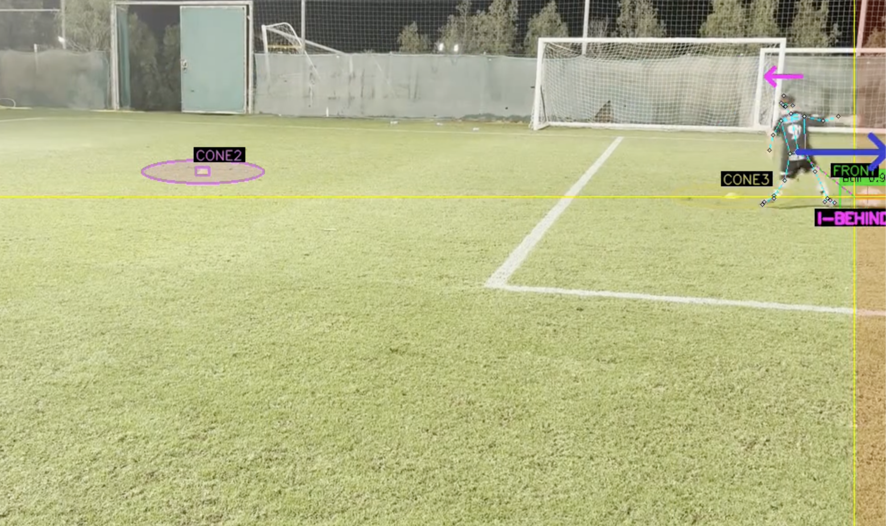

# Loss of Control Detection - Coach's Guide

> **Document Version:** 1.0
> **Last Updated:** January 2026
> **Audience:** Coaches and analysts reviewing drill performance

---

## Table of Contents

1. [What is Loss of Control Detection?](#what-is-loss-of-control-detection)
2. [Event Types in Detail](#event-types-in-detail)
   - [Boundary Violation](#1-boundary-violation-high-severity)
   - [Ball Behind Intention](#2-ball-behind-intention-medium-severity)
   - [Ball Behind Player](#3-ball-behind-player-medium-severity---being-phased-out)
3. [Understanding Severity Levels](#understanding-severity-levels)
4. [When Detection is Suppressed](#when-detection-is-suppressed)
5. [Tuning Detection Sensitivity](#tuning-detection-sensitivity)
6. [Planned Features (In Testing)](#planned-features-in-testing)
7. [Quick Reference](#quick-reference)

---

## What is Loss of Control Detection?

The Loss of Control system automatically identifies moments during a drill when the player loses control of the ball. Instead of manually reviewing entire videos, coaches can jump directly to these flagged moments.

<!-- TODO: Add screenshot of loss event in video player -->

The system detects **three types** of loss events:

| Event Type | What It Means | Severity |
|------------|---------------|----------|
| **Boundary Violation** | Ball left the camera frame | High |
| **Ball Behind Intention** | Ball is behind where the player is facing/looking | Medium |
| **Ball Behind Player** | Ball trails behind the player's movement direction | Medium |

Each detection fires only after the condition persists for a minimum duration (about 0.3-0.5 seconds) to avoid false alarms from brief, normal gameplay moments.

### Why Three Different Types?

Each event type catches a different kind of control problem:

- **Boundary Violation** = Complete loss (ball left the field of view)
- **Ball Behind Intention** = Attention problem (player looking wrong way)
- **Ball Behind Player** = Dribbling problem (ball dragging during movement)

Together, these provide a complete picture of ball control issues during drills.

---

## Event Types in Detail

### 1. Boundary Violation (High Severity)


> **Source:** [Link to video](https://aim-coach-portal-dev-gmgjjvjmpq-uc.a.run.app/players/692022483fdf8701c0d91d94/drills/692d7b1fbc4f8f681f845c2b) | Player: Dylan White | Drill: Triple Cone | Timestamp: ~6s

**What it catches:** The ball has left the video frame - typically kicked too hard or the player lost control and the ball rolled off-screen.

**How it works:**

1. The system tracks when the ball enters the "edge zone" (within ~33 pixels of frame edge)
2. If the ball then disappears (no longer detected) for ~0.5 seconds, it's flagged
3. Ball disappearing from the middle of the frame is ignored (likely a detection glitch, not a real loss)

**Visual representation:**

```
┌─────────────────────────────────────────────────────────┐
│ ← Edge Zone │                                 │ Edge Zone → │
│   (33px)    │         Safe Zone               │   (33px)    │
│             │                                 │             │
│  ⚽ HERE    │                                 │             │
│  = WARNING  │                                 │             │
│             │                                 │             │
│  ⚽ GONE    │                                 │             │
│  = FLAGGED  │                                 │             │
└─────────────────────────────────────────────────────────┘
```

**What coaches should look for:**

These are usually clear loss-of-control moments where the player needs to retrieve the ball. Common causes:
- Overhit pass or dribble
- Ball deflected off cone
- Player misjudged touch weight

---

### 2. Ball Behind Intention (Medium Severity)


**What it catches:** The ball is behind the player relative to where they're *looking/facing*, not where they're moving.

**How it works:**

1. Uses the player's **nose** and **hip** positions to determine which way they're facing
2. If the ball stays behind their facing direction for ~0.33 seconds, it's flagged
3. **NOT suppressed** in turning zones - if you're facing one way but ball is behind, that's still a problem

**Visual representation:**


> **Source:** [Link to video](https://aim-coach-portal-dev-gmgjjvjmpq-uc.a.run.app/players/692022493fdf8701c0d91dca/drills/692d7b1fbc4f8f681f845c2f) | Player: Fredrick McCromack | Drill: Triple Cone | Timestamp: ~23s

**I-BEHIND** = "Intention Behind" - the ball is behind the player's *intended* movement direction (where they want to move, based on where their torso and head are facing)

**What coaches should look for:**

Player's body orientation doesn't match ball position. This often indicates:
- Player looking for pass target while ball gets away
- Attention lapse during drill
- Poor awareness of ball position

---

### 3. Ball Behind Player (Medium Severity) - Being Phased Out

> **Status:** This detection type is being phased out in favor of Ball Behind Intention.
> It remains available as a predictive metric for coaches who find it useful.

**What it catches:** The ball trails behind the player's *movement direction* (momentum-based).

**How it works:**

1. Tracks hip movement over ~0.5 seconds to determine which way player is moving
2. If ball stays behind movement direction for ~0.33 seconds, it's flagged
3. **IS suppressed** in turning zones - it's normal for ball to be "behind" when changing direction around cones

**Why it's being phased out:**

The momentum-based approach has a fundamental limitation: during turns, players *intentionally* let the ball trail behind their movement direction. This is correct technique - you can't change direction instantly with the ball glued to your foot.

For example:
- Player moving RIGHT, about to turn LEFT
- Ball is momentarily "behind" the rightward momentum
- This is **good technique**, not loss of control

Even with turning zone suppression, edge cases cause false positives.

**Comparison: Intention vs Momentum**

The screenshot below shows why Ball Behind Intention is more accurate:


> **Source:** [Link to video](https://drive.google.com/file/d/1Gh2qhHwHS-h4EhyCRi6c8WcSsI8jJwf9/view?usp=share_link) | Player: Alex Mochar | Drill: Triple Cone | Timestamp: ~7s

In this example:
- **I-FRONT** (intention-based): Correctly identifies ball is IN FRONT of where player is facing
- **BEHIND** (momentum-based): Incorrectly flags ball as behind because player's momentum hasn't caught up to their new facing direction

**Why the logic still exists:**

While not a reliable "loss of control" detector, momentum-based tracking is useful as a **predictive metric**. A ball consistently trailing behind movement direction (outside of turns) can indicate:
- Player is pushing pace beyond their control ability
- Early warning sign that a loss event may follow
- Training load/fatigue indicator

**Recommendation:** Use Ball Behind Intention as your primary detection. Enable Ball Behind Player only if you want the additional predictive data for analysis.

---

## Understanding Severity Levels

Each loss event is assigned a severity level. This helps coaches prioritize which events to review first and helps group similar types of control issues.

### Current Severity Assignments

| Severity | Event Type | Why This Level |
|----------|------------|----------------|
| **High** | Boundary Violation | Complete loss - player must retrieve the ball. Drill is interrupted. |
| **Medium** | Ball Behind Intention | Control issue but recoverable. Player can correct without stopping. |
| **Medium** | Ball Behind Player | Control issue but recoverable. (Deprecated - use Intention instead) |

### How to Think About Severity

**High Severity** = Drill stops. The player has completely lost the ball and must go retrieve it. This is the clearest sign of a control failure.

**Medium Severity** = Warning sign. The player still has the ball nearby but their control is slipping. They can usually recover without stopping the drill.

### Guidelines for Future Event Types

If adding new loss detection types in the future, use this guide:

| Assign **High** if... | Assign **Medium** if... |
|-----------------------|-------------------------|
| Player must stop and retrieve ball | Player can recover without stopping |
| Drill flow is completely interrupted | Drill continues but control is poor |
| Ball leaves the playing area | Ball stays in play but position is bad |

---

## When Detection is Suppressed

The system is smart enough to **NOT** flag certain situations:

### 1. Warmup Period (First 3 Seconds)

The first 3 seconds of each drill are ignored. This allows:
- Player to get set up
- Initial ball placement
- First touch to get going

### 2. Brief Moments

All detections require the condition to persist:
- **Boundary Violation:** ~0.5 seconds off-screen
- **Ball Behind (both types):** ~0.33 seconds

A ball momentarily being in a "bad" position and immediately recovering is not flagged.

---

## Tuning Detection Sensitivity

You can adjust how sensitive the detection is. Here are the key settings:

### Making Detection MORE Sensitive

Use these settings to catch more events (useful if you're missing obvious losses):

| Setting | Default | More Sensitive | Effect |
|---------|---------|----------------|--------|
| `behind_threshold` | 13 pixels | 8-10 pixels | Flags ball as "behind" when closer to player |
| `behind_sustained_frames` | 10 frames (~0.33s) | 6-8 frames | Flags faster (less time needed) |
| `boundary_sustained_frames` | 15 frames (~0.5s) | 10 frames | Flags boundary violations faster |

### Making Detection LESS Sensitive

Use these settings to reduce false positives (useful if getting too many flags):

| Setting | Default | Less Sensitive | Effect |
|---------|---------|----------------|--------|
| `behind_threshold` | 13 pixels | 18-20 pixels | Ball must be further behind to flag |
| `behind_sustained_frames` | 10 frames | 15 frames | Must persist longer before flagging |
| `direction_consistency_ratio` | 70% | 80% | Requires more consistent direction |

### Disabling Specific Detection Types

Turn off individual detection types if they're not useful for your analysis:

| Setting | What it controls |
|---------|------------------|
| `enable_boundary_violation` | Ball leaving the frame |
| `enable_ball_behind_player` | Ball behind movement direction |
| `enable_ball_behind_intention` | Ball behind facing direction |

Set any to `False` to disable that detection.

**Example use cases:**
- Disable `ball_behind_player` if you only care about complete losses (boundary violations)
- Disable `ball_behind_intention` if pose detection isn't reliable for your videos

---

## Planned Features (In Testing)

These detection types are being developed and tested. They are not yet active in production.

### Off-Path Detection (Medium Severity)

> **Status:** In testing - validating accuracy before release


> **Source:** [Link to video]() | Player: [Name] | Drill: [Drill Name]

**Reading the screenshot:**
- **"vert dev"** = Vertical Deviation detected
- **Yellow arrow** = Shows the general momentum of the ball moving up the screen (away from camera)
- **"8f"** = Deviation detected for 8 frames (~0.27 seconds at 30fps)
- This is a deviation from the expected left-right movement pattern of the Triple Cone drill

**What it will catch:** Ball moving vertically (up/down on screen) more than expected in drills where horizontal (left-right) movement is the norm.

**Target drills:**
- 7 Cone Weave
- Triple Cone
- 5 Cone
- Dribble Zig Zag Dribble
- Other horizontal-movement drills

**The logic:**

In these drills, the player should primarily move left-right across the screen. If the ball starts moving significantly up or down, it suggests:
- Player has gone off the intended drill path
- Ball was pushed too far forward or backward
- Control issue causing deviation from the drill pattern

**Why Medium Severity:**

Following the severity guidelines:
- Player can usually recover without stopping the drill
- Ball stays in play but position deviates from intended path
- It's a control/technique issue, not a complete loss

**What coaches will look for:**

Player deviating from the expected drill path - moving toward/away from camera instead of across the drill pattern.

---

## Quick Reference

### Detection Summary Table

| Detection Type | Trigger Condition | Duration Required | Status |
|----------------|-------------------|-------------------|--------|
| Boundary Violation | Ball leaves frame edge | ~0.5 seconds | Active |
| Ball Behind Intention | Ball behind facing direction | ~0.33 seconds | Active (Primary) |
| Ball Behind Player | Ball behind movement direction | ~0.33 seconds | Deprecated |

### Key Thresholds at a Glance

| Threshold | Value | What it means |
|-----------|-------|---------------|
| `min_timestamp_seconds` | 3.0s | Skip first 3 seconds (warmup) |
| `behind_threshold` | 13 pixels | How far "behind" counts as behind |
| `behind_sustained_frames` | 10 frames | Ball must be behind for this long |
| `boundary_sustained_frames` | 15 frames | Ball must be off-screen for this long |
| `edge_margin` | 33 pixels | Distance from edge that counts as "edge zone" |

### Coach's Interpretation Guide

| Event | What Happened | Coaching Focus |
|-------|---------------|----------------|
| **Boundary Violation** | Player lost the ball completely - had to retrieve it | Touch weight, ball control under pressure |
| **Ball Behind Intention** | Player's attention/body facing wrong direction | Awareness, keeping ball in view |
| **Ball Behind Player** | Ball dragging during dribbling | Close control at speed |

---

*For technical implementation details, see the source code in `aim_data_analyser/loss_detection/`*
